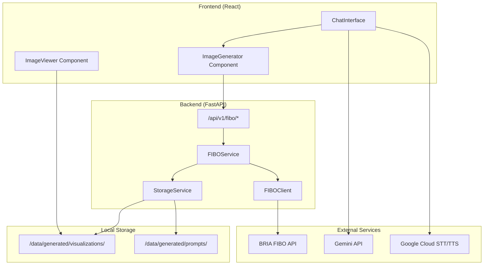

# Design Document: FIBO Integration

## Overview

This design document describes the integration of BRIA's FIBO cloud API into the FIBOMed medical visualization platform. The integration enables users to generate medical visualizations from text prompts through a chat interface, with support for iterative refinement and proper storage of generated assets.

The system uses a CPU-only architecture where all image generation is handled by BRIA's hosted API service, eliminating the need for local GPU resources. The integration follows the existing FastAPI backend pattern and React frontend architecture.

## Architecture



## Components and Interfaces

### Backend Components

#### 1. FIBOClient (`backend/app/integrations/bria_fibo/client.py`)

Handles direct communication with BRIA's FIBO API.

```python
class FIBOClient:
    """Client for BRIA FIBO API"""
    
    BASE_URL = "https://engine.prod.bria-api.com/v2"
    
    def __init__(self, api_key: str):
        self.api_key = api_key
        self.session = httpx.AsyncClient(timeout=120.0)
    
    async def generate_image(
        self,
        prompt: Optional[str] = None,
        images: Optional[List[str]] = None,
        structured_prompt: Optional[str] = None,
        negative_prompt: Optional[str] = None,
        aspect_ratio: str = "1:1",
        seed: Optional[int] = None,
        sync: bool = True
    ) -> FIBOGenerationResult:
        """Generate image using FIBO API"""
        ...
    
    async def poll_status(self, status_url: str) -> FIBOGenerationResult:
        """Poll async generation status"""
        ...
```

#### 2. FIBOService (`backend/app/services/fibo_service.py`)

Business logic layer for FIBO operations.

```python
class FIBOService:
    """Service for FIBO image generation operations"""
    
    def __init__(self):
        self.client = FIBOClient(settings.FIBO_PROD_API_KEY)
        self.storage = StorageService()
    
    async def generate_visualization(
        self,
        prompt: str,
        aspect_ratio: str = "1:1",
        session_id: Optional[str] = None
    ) -> VisualizationResult:
        """Generate a new visualization from text prompt"""
        ...
    
    async def refine_visualization(
        self,
        visualization_id: str,
        refinement_prompt: str
    ) -> VisualizationResult:
        """Refine an existing visualization"""
        ...
    
    async def get_visualization(
        self,
        visualization_id: str
    ) -> VisualizationResult:
        """Retrieve a stored visualization"""
        ...
```

#### 3. StorageService (`backend/app/services/storage_service.py`)

Handles file storage for images and prompts.

```python
class StorageService:
    """Service for storing generated visualizations and prompts"""
    
    def __init__(self):
        self.viz_path = Path(settings.GENERATED_PATH) / "visualizations"
        self.prompt_path = Path(settings.GENERATED_PATH) / "prompts"
    
    async def save_visualization(
        self,
        image_url: str,
        structured_prompt: str,
        seed: int,
        parent_id: Optional[str] = None
    ) -> str:
        """Download and save visualization with metadata"""
        ...
    
    async def get_prompt(self, visualization_id: str) -> dict:
        """Retrieve stored prompt for a visualization"""
        ...
```

#### 4. API Endpoints (`backend/app/api/v1/fibo.py`)

```python
router = APIRouter(prefix="/fibo", tags=["fibo"])

@router.post("/generate", response_model=VisualizationResponse)
async def generate_visualization(request: GenerateRequest):
    """Generate a new visualization from text prompt"""
    ...

@router.post("/refine/{visualization_id}", response_model=VisualizationResponse)
async def refine_visualization(
    visualization_id: str,
    request: RefineRequest
):
    """Refine an existing visualization"""
    ...

@router.get("/{visualization_id}", response_model=VisualizationResponse)
async def get_visualization(visualization_id: str):
    """Get visualization details"""
    ...
```

### Frontend Components

#### 1. ImageGenerator Component (`frontend/src/components/chat/ImageGenerator.tsx`)

```typescript
interface ImageGeneratorProps {
  onImageGenerated: (result: VisualizationResult) => void;
  onError: (error: string) => void;
  disabled?: boolean;
}

const ImageGenerator: React.FC<ImageGeneratorProps> = ({
  onImageGenerated,
  onError,
  disabled
}) => {
  // Handles prompt input and generation trigger
  // Shows loading state during generation
  // Supports aspect ratio selection
};
```

#### 2. ImageViewer Component (`frontend/src/components/chat/ImageViewer.tsx`)

```typescript
interface ImageViewerProps {
  imageUrl: string;
  visualizationId: string;
  onRefine?: (prompt: string) => void;
  allowFullscreen?: boolean;
}

const ImageViewer: React.FC<ImageViewerProps> = ({
  imageUrl,
  visualizationId,
  onRefine,
  allowFullscreen = true
}) => {
  // Displays generated image
  // Supports fullscreen modal
  // Provides refinement input
};
```

### Configuration Updates

#### Updated Settings (`backend/app/config.py`)

```python
class Settings(BaseSettings):
    # Existing settings...
    
    # FIBO API Settings
    FIBO_PROD_API_KEY: str
    FIBO_API_BASE_URL: str = "https://engine.prod.bria-api.com/v2"
    FIBO_DEFAULT_ASPECT_RATIO: str = "1:1"
    FIBO_SYNC_MODE: bool = True
    FIBO_TIMEOUT: int = 120
    
    class Config:
        env_file = "secrets/.env"
        case_sensitive = True
```

## Data Models

### Backend Schemas (`backend/app/schemas/fibo_schemas.py`)

```python
from pydantic import BaseModel
from typing import Optional, List
from datetime import datetime

class GenerateRequest(BaseModel):
    """Request to generate a new visualization"""
    prompt: str
    aspect_ratio: str = "1:1"
    negative_prompt: Optional[str] = None
    session_id: Optional[str] = None

class RefineRequest(BaseModel):
    """Request to refine an existing visualization"""
    prompt: str
    seed: Optional[int] = None

class VisualizationResponse(BaseModel):
    """Response containing visualization details"""
    visualization_id: str
    image_url: str
    structured_prompt: dict
    seed: int
    parent_id: Optional[str] = None
    created_at: datetime

class FIBOAPIResponse(BaseModel):
    """Response from FIBO API"""
    result: Optional[dict] = None
    request_id: str
    status_url: Optional[str] = None
    warning: Optional[str] = None
    error: Optional[dict] = None
```

### Frontend Types (`frontend/src/types/fibo.types.ts`)

```typescript
export interface GenerateRequest {
  prompt: string;
  aspectRatio?: string;
  negativePrompt?: string;
  sessionId?: string;
}

export interface RefineRequest {
  prompt: string;
  seed?: number;
}

export interface VisualizationResult {
  visualizationId: string;
  imageUrl: string;
  structuredPrompt: object;
  seed: number;
  parentId?: string;
  createdAt: string;
}

export type AspectRatio = 
  | "1:1" | "2:3" | "3:2" | "3:4" | "4:3" 
  | "4:5" | "5:4" | "9:16" | "16:9";
```

### Storage Schema (`data/generated/prompts/{id}.json`)

```json
{
  "visualization_id": "uuid-string",
  "structured_prompt": { /* FIBO structured prompt object */ },
  "seed": 12345,
  "parent_id": null,
  "original_prompt": "user's text prompt",
  "aspect_ratio": "1:1",
  "created_at": "2025-12-13T10:00:00Z",
  "api_request_id": "bria-request-id"
}
```


## Correctness Properties

*A property is a characteristic or behavior that should hold true across all valid executions of a system-essentially, a formal statement about what the system should do. Properties serve as the bridge between human-readable specifications and machine-verifiable correctness guarantees.*

Based on the acceptance criteria analysis, the following correctness properties must be validated:

### Property 1: Environment Variable Loading Completeness
*For any* required environment variable defined in the Settings class, when the application loads from `secrets/.env`, that variable SHALL be accessible via the settings object with a non-empty value.
**Validates: Requirements 1.1, 1.2, 1.3, 1.4**

### Property 2: Missing Environment Variable Error Descriptiveness
*For any* required environment variable that is missing from the environment, the system SHALL raise a ValidationError whose message contains the name of the missing variable.
**Validates: Requirements 1.5**

### Property 3: API Request Prompt Preservation
*For any* text prompt submitted for image generation, the FIBO API request body SHALL contain the exact prompt string unchanged.
**Validates: Requirements 2.1, 2.5**

### Property 4: API Response Field Extraction
*For any* successful FIBO API response containing a result object, the system SHALL extract both `image_url` and `structured_prompt` fields without data loss.
**Validates: Requirements 2.2**

### Property 5: Image Storage Path Consistency
*For any* generated visualization, the saved image file path SHALL match the pattern `data/generated/visualizations/{visualization_id}.{extension}` and the file SHALL exist on disk.
**Validates: Requirements 2.3, 2.4**

### Property 6: Refinement Request Completeness
*For any* refinement operation on an existing visualization, the FIBO API request SHALL include both the refinement prompt AND the original structured_prompt AND the original seed value.
**Validates: Requirements 3.1, 3.4**

### Property 7: Prompt Lineage Tracking
*For any* refined visualization, the stored prompt metadata SHALL contain a `parent_id` field referencing the original visualization's ID.
**Validates: Requirements 3.3, 7.3**

### Property 8: Frontend Image Rendering
*For any* visualization result with a valid image_url, the ChatInterface component SHALL render an `` element with `src` attribute matching the image_url.
**Validates: Requirements 4.1**

### Property 9: Error Message Propagation
*For any* FIBO API error response, the system SHALL return an error message to the frontend that includes the API's error code or message.
**Validates: Requirements 4.3, 5.3**

### Property 10: Sync Mode Default
*For any* FIBO API request where sync mode is not explicitly specified, the request SHALL include `sync: true` parameter.
**Validates: Requirements 5.1**

### Property 11: Async Polling Completion
*For any* FIBO API response with status 202, the system SHALL poll the status_url until receiving a final result (200) or error status.
**Validates: Requirements 5.2**

### Property 12: Timeout Retry Behavior
*For any* FIBO API request that times out, the system SHALL retry exactly once before returning a timeout error to the user.
**Validates: Requirements 5.4**

### Property 13: Default Aspect Ratio
*For any* image generation request where aspect_ratio is not specified, the FIBO API request SHALL include `aspect_ratio: "1:1"`.
**Validates: Requirements 6.1**

### Property 14: Aspect Ratio Passthrough
*For any* valid aspect ratio specified by the user, the FIBO API request SHALL include that exact aspect_ratio value.
**Validates: Requirements 6.2**

### Property 15: Invalid Aspect Ratio Validation
*For any* aspect ratio value not in the valid set (1:1, 2:3, 3:2, 3:4, 4:3, 4:5, 5:4, 9:16, 16:9), the system SHALL return a validation error listing all valid options.
**Validates: Requirements 6.3**

### Property 16: Prompt Metadata Completeness
*For any* stored prompt JSON file, the file SHALL contain `seed` (integer), `created_at` (ISO timestamp), and `structured_prompt` (object) fields.
**Validates: Requirements 7.1, 7.2**

## Error Handling

### API Errors

| Error Code | Handling Strategy |
|------------|-------------------|
| 400 | Return validation error with details to user |
| 401 | Log authentication failure, return generic auth error |
| 403 | Return permission denied error |
| 422 | Return content moderation failure message |
| 429 | Implement exponential backoff, retry up to 3 times |
| 5XX | Retry once, then return service unavailable error |

### Client-Side Errors

```typescript
class FIBOError extends Error {
  constructor(
    message: string,
    public code: string,
    public details?: string
  ) {
    super(message);
    this.name = 'FIBOError';
  }
}

// Error types
type FIBOErrorCode = 
  | 'GENERATION_FAILED'
  | 'REFINEMENT_FAILED'
  | 'INVALID_ASPECT_RATIO'
  | 'API_TIMEOUT'
  | 'STORAGE_ERROR'
  | 'VISUALIZATION_NOT_FOUND';
```

### Backend Exception Classes

```python
class FIBOError(Exception):
    """Base exception for FIBO operations"""
    def __init__(self, message: str, code: str, details: str = None):
        self.message = message
        self.code = code
        self.details = details
        super().__init__(message)

class FIBOAPIError(FIBOError):
    """Error from FIBO API"""
    pass

class FIBOStorageError(FIBOError):
    """Error storing visualization"""
    pass

class FIBOValidationError(FIBOError):
    """Validation error for FIBO requests"""
    pass
```

## Testing Strategy

### Property-Based Testing Library

The project will use **Hypothesis** for Python property-based testing and **fast-check** for TypeScript/JavaScript property-based testing.

### Test Configuration

- Minimum 100 iterations per property test
- Each property test must be tagged with the format: `**Feature: fibo-integration, Property {number}: {property_text}**`

### Unit Tests

Unit tests will cover:
- FIBOClient initialization with valid/invalid API keys
- Request building for different generation scenarios
- Response parsing for success and error cases
- File storage operations
- Frontend component rendering states

### Property-Based Tests

Each correctness property will have a corresponding property-based test:

```python
# Example: Property 3 - API Request Prompt Preservation
from hypothesis import given, strategies as st

@given(prompt=st.text(min_size=1, max_size=1000))
def test_api_request_preserves_prompt(prompt):
    """
    **Feature: fibo-integration, Property 3: API Request Prompt Preservation**
    For any text prompt, the API request body contains the exact prompt unchanged.
    """
    request = build_fibo_request(prompt=prompt)
    assert request["prompt"] == prompt
```

```typescript
// Example: Property 8 - Frontend Image Rendering
import fc from 'fast-check';

test('renders image with correct src for any valid URL', () => {
  /**
   * **Feature: fibo-integration, Property 8: Frontend Image Rendering**
   * For any valid image URL, the component renders an img with matching src.
   */
  fc.assert(
    fc.property(fc.webUrl(), (imageUrl) => {
      const result = { imageUrl, visualizationId: 'test-id' };
      const { getByRole } = render(<ImageViewer {...result} />);
      const img = getByRole('img');
      expect(img.getAttribute('src')).toBe(imageUrl);
    })
  );
});
```

### Integration Tests

Integration tests will verify:
- End-to-end flow from prompt submission to image display
- Refinement workflow with prompt history
- Error handling across the full stack
- Environment configuration loading

### Test File Structure

```
backend/
  tests/
    unit/
      test_fibo_client.py
      test_fibo_service.py
      test_storage_service.py
    property/
      test_fibo_properties.py
    integration/
      test_fibo_api.py

frontend/
  src/
    components/chat/
      ImageGenerator.test.tsx
      ImageViewer.test.tsx
    api/
      fibo.api.test.ts
```


## Deployment Script

A unified run script will be created at the project root to start both backend and frontend services.

### Run Script (`run.bat` for Windows / `run.sh` for Unix)

```batch
@echo off
REM run.bat - Windows script to run FIBOMed

echo Starting FIBOMed Application...

REM Load environment variables from secrets/.env
for /f "tokens=*" %%a in (secrets\.env) do set %%a

REM Start backend in background
echo Starting Backend Server...
start "FIBOMed Backend" cmd /c "cd backend && python -m venv venv 2>nul && venv\Scripts\activate && pip install -r requirements.txt -q && python main.py"

REM Wait for backend to start
timeout /t 5 /nobreak >nul

REM Start frontend
echo Starting Frontend Server...
start "FIBOMed Frontend" cmd /c "cd frontend && npm install && npm run dev"

echo.
echo FIBOMed is starting...
echo Backend: http://localhost:8000
echo Frontend: http://localhost:5173
echo.
echo Press any key to stop all services...
pause >nul

REM Kill processes
taskkill /FI "WINDOWTITLE eq FIBOMed*" /F >nul 2>&1
```

### Script Features

1. **Environment Loading**: Loads all variables from `secrets/.env`
2. **Dependency Installation**: Auto-installs Python and Node dependencies if needed
3. **Parallel Startup**: Runs backend and frontend in separate terminal windows
4. **Graceful Shutdown**: Stops all services when user presses a key
5. **Status Display**: Shows URLs for both services
