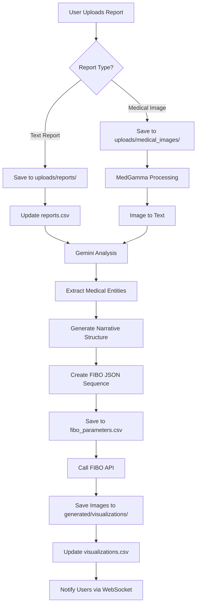

# FIBOMed: Medical Visual Storytelling Platform
## Complete Project Architecture Document

---

## 📋 **Project Overview**

**FIBOMed** is a JSON-native medical visualization platform that transforms complex medical reports into patient-understandable visual stories using BRIA FIBO's controllable image generation. The platform features a three-tier user system (Doctor, Patient, Technician) with expert-in-the-loop validation, creating a valuable training data pipeline for BRIA while improving healthcare communication.

---

## 🏗️ **Complete Project Structure**

```
FIBOMed/
│
├── .env                                    # Environment variables and API keys
├── .env.example                            # Template for environment variables
├── .gitignore                              # Git ignore configuration
├── README.md                               # Project documentation
├── docker-compose.yml                      # Docker configuration for deployment
├── requirements.txt                        # Python dependencies
├── package.json                            # Node.js dependencies
├── tsconfig.json                           # TypeScript configuration
├── vite.config.ts                          # Vite configuration
│
├── frontend/                               # React + TypeScript + Vite Frontend
│   ├── index.html                          # Entry HTML file
│   ├── package.json                        # Frontend dependencies
│   ├── tsconfig.json                       # TypeScript config for frontend
│   ├── vite.config.ts                      # Vite bundler configuration
│   │
│   ├── src/
│   │   ├── main.tsx                        # React app entry point
│   │   ├── App.tsx                         # Main app component with routing
│   │   ├── index.css                       # Global styles
│   │   ├── vite-env.d.ts                   # Vite TypeScript declarations
│   │   │
│   │   ├── types/                          # TypeScript type definitions
│   │   │   ├── user.types.ts               # User, Doctor, Patient, Technician types
│   │   │   ├── medical.types.ts            # Medical report, visualization types
│   │   │   ├── fibo.types.ts               # FIBO JSON parameter types
│   │   │   ├── chat.types.ts               # Chat and messaging types
│   │   │   └── api.types.ts                # API response/request types
│   │   │
│   │   ├── api/                            # API integration layer
│   │   │   ├── client.ts                   # Axios client configuration
│   │   │   ├── auth.api.ts                 # Authentication endpoints
│   │   │   ├── reports.api.ts              # Medical reports CRUD
│   │   │   ├── visualizations.api.ts       # FIBO visualization endpoints
│   │   │   ├── chat.api.ts                 # Chat and voice endpoints
│   │   │   ├── users.api.ts                # User management endpoints
│   │   │   └── websocket.ts                # WebSocket for real-time updates
│   │   │
│   │   ├── components/                     # Reusable UI components
│   │   │   ├── common/
│   │   │   │   ├── Header.tsx              # App header with navigation
│   │   │   │   ├── Footer.tsx              # App footer
│   │   │   │   ├── Sidebar.tsx             # Navigation sidebar
│   │   │   │   ├── LoadingSpinner.tsx      # Loading indicator
│   │   │   │   ├── ErrorBoundary.tsx       # Error handling wrapper
│   │   │   │   └── ProtectedRoute.tsx      # Route authentication guard
│   │   │   │
│   │   │   ├── auth/
│   │   │   │   ├── LoginForm.tsx           # Multi-role login form
│   │   │   │   ├── RegisterForm.tsx        # Registration with role selection
│   │   │   │   ├── RoleSelector.tsx        # Doctor/Patient/Technician selector
│   │   │   │   └── ProfileManager.tsx      # User profile management
│   │   │   │
│   │   │   ├── reports/
│   │   │   │   ├── ReportUploader.tsx      # Drag-drop report upload
│   │   │   │   ├── ReportViewer.tsx        # Display uploaded reports
│   │   │   │   ├── ReportList.tsx          # List of all reports
│   │   │   │   ├── MedicalImageUpload.tsx  # Medical image handler
│   │   │   │   └── ReportTimeline.tsx      # Timeline view of reports
│   │   │   │
│   │   │   ├── visualizations/
│   │   │   │   ├── FIBOViewer.tsx          # Main FIBO image viewer
│   │   │   │   ├── ParameterControls.tsx   # JSON parameter adjustment UI
│   │   │   │   ├── VisualizationGrid.tsx   # Grid view of generated images
│   │   │   │   ├── ComparisonView.tsx      # Side-by-side normal vs condition
│   │   │   │   ├── TimelineAnimation.tsx   # Treatment progression animation
│   │   │   │   ├── ComplexitySlider.tsx    # Patient/Student/Doctor view toggle
│   │   │   │   └── AnnotationEditor.tsx    # Add/edit image annotations
│   │   │   │
│   │   │   ├── expert-tools/
│   │   │   │   ├── RefinementPanel.tsx     # Doctor/Technician refinement UI
│   │   │   │   ├── JSONEditor.tsx          # Direct JSON parameter editing
│   │   │   │   ├── AccuracyValidator.tsx   # Medical accuracy checklist
│   │   │   │   ├── CorrectionTracker.tsx   # Track all corrections for training
│   │   │   │   └── BatchProcessor.tsx      # Bulk report processing
│   │   │   │
│   │   │   ├── chat/
│   │   │   │   ├── ChatInterface.tsx       # Main chat component
│   │   │   │   ├── VoiceInput.tsx          # Speech-to-text input
│   │   │   │   ├── MessageList.tsx         # Chat message history
│   │   │   │   ├── SmartSuggestions.tsx    # AI-powered response suggestions
│   │   │   │   └── MediaAttachment.tsx     # Attach reports/images to chat
│   │   │   │
│   │   │   └── analytics/
│   │   │       ├── DashboardDoctor.tsx     # Doctor's analytics dashboard
│   │   │       ├── DashboardPatient.tsx    # Patient progress dashboard
│   │   │       ├── AccuracyMetrics.tsx     # Visualization accuracy tracking
│   │   │       └── UsageStatistics.tsx     # Platform usage analytics
│   │   │
│   │   ├── pages/                          # Page components
│   │   │   ├── Home.tsx                    # Landing page
│   │   │   ├── Login.tsx                   # Login page
│   │   │   ├── Register.tsx                # Registration page
│   │   │   │
│   │   │   ├── doctor/
│   │   │   │   ├── DoctorDashboard.tsx     # Doctor's main dashboard
│   │   │   │   ├── PatientManagement.tsx   # Manage assigned patients
│   │   │   │   ├── ReportReview.tsx        # Review and validate reports
│   │   │   │   └── VisualizationStudio.tsx # Create/edit visualizations
│   │   │   │
│   │   │   ├── patient/
│   │   │   │   ├── PatientDashboard.tsx    # Patient's main dashboard
│   │   │   │   ├── MyReports.tsx           # View personal medical reports
│   │   │   │   ├── VisualStories.tsx       # View visual explanations
│   │   │   │   └── HealthTimeline.tsx      # Personal health journey
│   │   │   │
│   │   │   ├── technician/
│   │   │   │   ├── TechnicianDashboard.tsx # Technician's workspace
│   │   │   │   ├── ImageProcessing.tsx     # Medical image analysis
│   │   │   │   ├── QualityControl.tsx      # Verify visualization quality
│   │   │   │   └── BatchOperations.tsx     # Bulk processing tasks
│   │   │   │
│   │   │   └── shared/
│   │   │       ├── ReportDetails.tsx       # Detailed report view (all users)
│   │   │       ├── VisualizationView.tsx   # Full visualization viewer
│   │   │       ├── ChatRoom.tsx            # Multi-user chat room
│   │   │       └── Settings.tsx            # User settings page
│   │   │
│   │   ├── hooks/                          # Custom React hooks
│   │   │   ├── useAuth.ts                  # Authentication state management
│   │   │   ├── useWebSocket.ts             # WebSocket connection handler
│   │   │   ├── useFIBOGenerator.ts         # FIBO generation state
│   │   │   ├── useVoiceRecognition.ts      # Voice input handling
│   │   │   ├── useReportData.ts            # Report data fetching
│   │   │   └── useRolePermissions.ts       # Role-based permissions
│   │   │
│   │   ├── contexts/                       # React Context providers
│   │   │   ├── AuthContext.tsx             # Authentication context
│   │   │   ├── ThemeContext.tsx            # Theme/appearance context
│   │   │   ├── WebSocketContext.tsx        # WebSocket connection context
│   │   │   └── NotificationContext.tsx     # Toast/notification context
│   │   │
│   │   ├── utils/                          # Utility functions
│   │   │   ├── validators.ts               # Form validation utilities
│   │   │   ├── formatters.ts               # Data formatting helpers
│   │   │   ├── fileHandlers.ts             # File upload/download utilities
│   │   │   ├── jsonHelpers.ts              # FIBO JSON manipulation
│   │   │   └── constants.ts                # App-wide constants
│   │   │
│   │   └── styles/                         # CSS modules and themes
│   │       ├── themes/
│   │       │   ├── light.css               # Light theme
│   │       │   └── dark.css                # Dark theme
│   │       └── components/                 # Component-specific styles
│   │
│   └── public/                             # Static assets
│       ├── icons/                          # App icons
│       ├── images/                         # Static images
│       └── medical-assets/                 # Medical reference images
│
├── backend/                                # Python FastAPI Backend
│   ├── main.py                             # FastAPI application entry point
│   ├── requirements.txt                    # Python dependencies
│   ├── pytest.ini                          # Testing configuration
│   │
│   ├── app/
│   │   ├── __init__.py
│   │   ├── config.py                       # Application configuration
│   │   ├── dependencies.py                 # Dependency injection
│   │   ├── middleware.py                   # Custom middleware (CORS, auth, etc.)
│   │   │
│   │   ├── models/                         # Data models (Pydantic classes for CSV)
│   │   │   ├── __init__.py
│   │   │   ├── user_model.py               # User, Doctor, Patient, Technician models
│   │   │   ├── report_model.py             # Medical report model
│   │   │   ├── visualization_model.py      # FIBO visualization model
│   │   │   ├── chat_model.py               # Chat message model
│   │   │   ├── correction_model.py         # Expert correction model
│   │   │   ├── relationship_model.py       # User relationships model
│   │   │   └── audit_model.py              # System audit model
│   │   │
│   │   ├── schemas/                        # Pydantic validation schemas
│   │   │   ├── __init__.py
│   │   │   ├── user_schemas.py             # User-related schemas
│   │   │   ├── report_schemas.py           # Report validation schemas
│   │   │   ├── fibo_schemas.py             # FIBO JSON parameter schemas
│   │   │   ├── chat_schemas.py             # Chat message schemas
│   │   │   ├── visualization_schemas.py    # Visualization data schemas
│   │   │   └── response_schemas.py         # API response schemas
│   │   │
│   │   ├── database/                       # CSV Database Management
│   │   │   ├── __init__.py
│   │   │   ├── csv_handler.py              # Core CSV read/write operations
│   │   │   ├── csv_manager.py              # CSV database manager (CRUD)
│   │   │   ├── csv_indexer.py              # Indexing for fast lookups
│   │   │   ├── csv_relations.py            # Handle relationships between CSVs
│   │   │   ├── csv_backup.py               # Backup and recovery
│   │   │   └── csv_locks.py                # File locking for concurrent access
│   │   │
│   │   ├── api/                            # API route handlers
│   │   │   ├── __init__.py
│   │   │   ├── v1/
│   │   │   │   ├── __init__.py
│   │   │   │   ├── auth.py                 # Authentication endpoints
│   │   │   │   ├── users.py                # User management endpoints
│   │   │   │   ├── reports.py              # Report CRUD operations
│   │   │   │   ├── visualizations.py       # FIBO visualization endpoints
│   │   │   │   ├── chat.py                 # Chat functionality
│   │   │   │   ├── expert_tools.py         # Doctor/Technician tools
│   │   │   │   ├── analytics.py            # Analytics and metrics
│   │   │   │   └── websocket.py            # WebSocket endpoints
│   │   │   │
│   │   │   └── internal/
│   │   │       ├── admin.py                # Admin-only endpoints
│   │   │       └── health.py               # Health check endpoints
│   │   │
│   │   ├── services/                       # Business logic services
│   │   │   ├── __init__.py
│   │   │   ├── auth_service.py             # Authentication logic
│   │   │   ├── report_service.py           # Report processing
│   │   │   ├── fibo_service.py             # FIBO API integration
│   │   │   ├── gemini_service.py           # Gemini Flash integration
│   │   │   ├── medical_image_service.py    # Medical image processing
│   │   │   ├── json_generator_service.py   # FIBO JSON generation
│   │   │   ├── chat_service.py             # Chat functionality
│   │   │   ├── voice_service.py            # Speech-to-text/text-to-speech
│   │   │   ├── correction_service.py       # Expert correction tracking
│   │   │   ├── notification_service.py     # Email/push notifications
│   │   │   └── analytics_service.py        # Analytics computation
│   │   │
│   │   ├── core/                           # Core functionality
│   │   │   ├── __init__.py
│   │   │   ├── security.py                 # JWT, password hashing
│   │   │   ├── permissions.py              # Role-based access control
│   │   │   ├── exceptions.py               # Custom exception classes
│   │   │   ├── logging_config.py           # Logging configuration
│   │   │   └── cache.py                    # In-memory cache for CSV data
│   │   │
│   │   ├── integrations/                   # External API integrations
│   │   │   ├── __init__.py
│   │   │   ├── bria_fibo/
│   │   │   │   ├── __init__.py
│   │   │   │   ├── client.py               # BRIA FIBO API client
│   │   │   │   ├── json_builder.py         # FIBO JSON parameter builder
│   │   │   │   ├── parameter_templates.py  # Predefined parameter sets
│   │   │   │   └── batch_processor.py      # Batch generation handler
│   │   │   │
│   │   │   ├── google_gemini/
│   │   │   │   ├── __init__.py
│   │   │   │   ├── client.py               # Gemini API client
│   │   │   │   ├── prompt_builder.py       # Medical prompt construction
│   │   │   │   └── report_analyzer.py      # Medical report analysis
│   │   │   │
│   │   │   ├── medical_models/
│   │   │   │   ├── __init__.py
│   │   │   │   ├── medgamma_client.py      # MedGamma integration
│   │   │   │   └── image_analyzer.py       # Medical image analysis
│   │   │   │
│   │   │   └── storage/
│   │   │       ├── __init__.py
│   │   │       ├── file_storage.py         # Local file storage for images
│   │   │       └── report_storage.py       # Report file management
│   │   │
│   │   ├── ml/                             # Machine Learning components
│   │   │   ├── __init__.py
│   │   │   ├── medical_ontology.py         # Medical knowledge base
│   │   │   ├── parameter_optimizer.py      # FIBO parameter optimization
│   │   │   ├── quality_scorer.py           # Visualization quality scoring
│   │   │   └── training_exporter.py        # Export corrections for BRIA
│   │   │
│   │   ├── workers/                        # Background task workers
│   │   │   ├── __init__.py
│   │   │   ├── task_queue.py               # Simple task queue implementation
│   │   │   ├── tasks/
│   │   │   │   ├── __init__.py
│   │   │   │   ├── report_tasks.py         # Report processing tasks
│   │   │   │   ├── generation_tasks.py     # FIBO generation tasks
│   │   │   │   ├── notification_tasks.py   # Async notifications
│   │   │   │   └── analytics_tasks.py      # Analytics computation
│   │   │   │
│   │   │   └── schedulers/
│   │   │       ├── __init__.py
│   │   │       └── periodic_tasks.py       # Scheduled tasks
│   │   │
│   │   └── utils/                          # Utility functions
│   │       ├── __init__.py
│   │       ├── validators.py               # Data validation utilities
│   │       ├── formatters.py               # Data formatting
│   │       ├── file_handlers.py            # File processing
│   │       ├── medical_utils.py            # Medical-specific utilities
│   │       ├── json_utils.py               # JSON manipulation helpers
│   │       └── csv_utils.py                # CSV-specific utilities
│   │
│   └── tests/                              # Test suite
│       ├── __init__.py
│       ├── conftest.py                     # Pytest fixtures
│       ├── unit/                           # Unit tests
│       ├── integration/                    # Integration tests
│       └── e2e/                            # End-to-end tests
│
├── data/                                   # CSV Database Files
│   ├── csv_files/                          # All CSV data files
│   │   ├── users.csv                       # All user accounts
│   │   ├── doctors.csv                     # Doctor-specific data
│   │   ├── patients.csv                    # Patient-specific data
│   │   ├── technicians.csv                 # Technician-specific data
│   │   ├── reports.csv                     # Medical reports metadata
│   │   ├── visualizations.csv              # FIBO visualization records
│   │   ├── fibo_parameters.csv             # Stored FIBO JSON parameters
│   │   ├── chat_messages.csv               # Chat message history
│   │   ├── chat_rooms.csv                  # Chat room metadata
│   │   ├── corrections.csv                 # Expert corrections for training
│   │   ├── relationships.csv               # User-to-user relationships
│   │   ├── sessions.csv                    # Active user sessions
│   │   ├── audit_log.csv                   # System audit trail
│   │   └── analytics.csv                   # Analytics data
│   │
│   ├── indexes/                            # CSV index files for fast lookup
│   │   ├── users_index.json                # User ID index
│   │   ├── reports_index.json              # Report ID index
│   │   └── relationships_index.json        # Relationship mappings
│   │
│   ├── backups/                            # CSV backup files
│   │   └── daily/                          # Daily backups
│   │
│   ├── uploads/                            # User uploaded files
│   │   ├── reports/                        # Uploaded report files
│   │   ├── medical_images/                 # Uploaded medical images
│   │   └── temp/                           # Temporary upload storage
│   │
│   └── generated/                          # Generated content
│       ├── visualizations/                 # FIBO generated images
│       ├── thumbnails/                     # Image thumbnails
│       └── exports/                        # Training data exports
│
├── docs/                                   # Documentation
│   ├── API.md                              # API documentation
│   ├── SETUP.md                            # Setup instructions
│   ├── DEPLOYMENT.md                       # Deployment guide
│   ├── USER_GUIDE.md                       # User manual
│   ├── CSV_SCHEMA.md                       # CSV file schemas documentation
│   └── HACKATHON_SUBMISSION.md             # Hackathon specific docs
│
├── scripts/                                # Utility scripts
│   ├── setup.sh                            # Initial setup script
│   ├── init_csv.py                         # Initialize CSV files with headers
│   ├── backup_csv.py                       # Backup CSV files
│   ├── deploy.sh                           # Deployment script
│   ├── test.sh                             # Run tests
│   └── generate_sample_data.py             # Generate test data
│
└── examples/                               # Example files
    ├── sample_reports/                     # Sample medical reports
    ├── fibo_parameters/                    # Example FIBO JSON parameters
    ├── generated_visuals/                  # Example generated images
    └── api_requests/                       # Example API requests
```

---

## 📊 **CSV Database Schema**

### **users.csv**
```csv
id,email,username,password_hash,role,created_at,updated_at,is_active,last_login
```

### **doctors.csv**
```csv
user_id,license_number,specialization,hospital,years_experience,verification_status
```

### **patients.csv**
```csv
user_id,date_of_birth,blood_group,medical_history_summary,emergency_contact
```

### **technicians.csv**
```csv
user_id,certification,department,expertise_areas,verification_status
```

### **reports.csv**
```csv
id,patient_id,uploaded_by_id,report_type,file_path,upload_date,processed_status,analysis_result,created_at
```

### **visualizations.csv**
```csv
id,report_id,fibo_params_id,image_path,generation_date,complexity_level,approved_by,corrections_count,quality_score
```

### **fibo_parameters.csv**
```csv
id,visualization_id,json_params,template_used,created_by,created_at,version
```

### **relationships.csv**
```csv
id,doctor_id,patient_id,technician_id,relationship_type,created_at,status
```

### **corrections.csv**
```csv
id,visualization_id,corrected_by_id,original_params,corrected_params,correction_notes,timestamp
```

### **chat_messages.csv**
```csv
id,room_id,sender_id,message,message_type,attachment_path,timestamp,is_read
```

---

## 🔄 **Core Workflows**

### **1. Report Upload & Processing Workflow**



### **2. FIBO JSON Generation Pipeline**

```python
# Workflow Implementation Pattern
class FIBOGenerationPipeline:
    """
    Pipeline stages with CSV storage:
    """
    
    def stage1_analyze_report(self, report_id):
        """Read from reports.csv, analyze with Gemini"""
        
    def stage2_extract_entities(self, analysis):
        """Extract medical entities, store temporarily"""
        
    def stage3_create_narrative(self, entities):
        """Build visual story structure"""
        
    def stage4_generate_json(self, narrative):
        """Create FIBO params, save to fibo_parameters.csv"""
        
    def stage5_call_fibo(self, params_id):
        """Call FIBO API with parameters"""
        
    def stage6_save_results(self, images, params_id):
        """Save to visualizations.csv and file system"""
```

### **3. Expert Refinement Workflow**

```python
class ExpertRefinementWorkflow:
    """
    Doctor/Technician refinement with CSV tracking:
    """
    
    def load_visualization(self, viz_id):
        """Load from visualizations.csv"""
        
    def apply_corrections(self, corrections):
        """Save to corrections.csv"""
        
    def regenerate_with_params(self, new_params):
        """Update fibo_parameters.csv, regenerate"""
        
    def export_training_data(self):
        """Export corrections.csv for BRIA training"""
```

### **4. Multi-User Chat Workflow**

```python
class ChatWorkflow:
    """
    Real-time chat with CSV storage:
    """
    
    def send_message(self, room_id, sender_id, message):
        """Append to chat_messages.csv"""
        
    def attach_report(self, message_id, report_id):
        """Link report to message"""
        
    def get_chat_history(self, room_id):
        """Read from chat_messages.csv with pagination"""
```

---

## 💻 **Code Flow Architecture**

### **Frontend Code Flow**

```typescript
// 1. User Authentication Flow
Login → Auth API → Store JWT → Route to Dashboard

// 2. Report Upload Flow
Select File → Upload Component → API Call → Progress Tracking → Success Notification

// 3. Visualization Generation Flow
View Report → Request Generation → WebSocket Updates → Display Results → Allow Refinement

// 4. Expert Refinement Flow
Load Visualization → Modify Parameters → Preview Changes → Save Corrections → Regenerate

// 5. Chat Integration Flow
Open Chat → Load History → Send Message → Real-time Updates → Attach Media
```

### **Backend Code Flow**

```python
# 1. API Request Flow
Request → Middleware (CORS, Auth) → Route Handler → Service Layer → CSV Operations → Response

# 2. Report Processing Flow
class ReportProcessor:
    def process(self, report_file):
        # Save file to disk
        file_path = self.save_upload(report_file)
        
        # Create CSV record
        report_id = self.csv_manager.create_report(file_path)
        
        # Analyze with Gemini
        analysis = self.gemini_service.analyze(file_path)
        
        # Generate FIBO params
        params = self.json_generator.create_params(analysis)
        
        # Save params to CSV
        params_id = self.csv_manager.save_params(params)
        
        # Queue generation task
        self.task_queue.add(generate_visualization, params_id)
        
        return report_id

# 3. FIBO Generation Flow
class FIBOGenerator:
    def generate(self, params_id):
        # Load params from CSV
        params = self.csv_manager.get_params(params_id)
        
        # Call FIBO API
        images = self.fibo_client.generate(params)
        
        # Save images
        image_paths = self.save_images(images)
        
        # Update CSV
        self.csv_manager.create_visualization(params_id, image_paths)
        
        # Notify via WebSocket
        self.websocket.broadcast(f"generation_complete_{params_id}")

# 4. CSV Management Flow
class CSVManager:
    def __init__(self):
        self.lock_manager = FileLockManager()
        self.indexer = CSVIndexer()
        
    def read_record(self, csv_file, record_id):
        with self.lock_manager.read_lock(csv_file):
            # Use index for fast lookup
            row = self.indexer.get_row(csv_file, record_id)
            return row
    
    def write_record(self, csv_file, record):
        with self.lock_manager.write_lock(csv_file):
            # Append to CSV
            self.append_row(csv_file, record)
            # Update index
            self.indexer.update(csv_file, record['id'])
```

---

## 🔐 **Security & Performance Considerations**

### **CSV File Management**
```python
class CSVSecurity:
    """
    - File locking for concurrent access
    - Regular backups
    - Index files for performance
    - In-memory caching for frequently accessed data
    - Pagination for large datasets
    """

class PerformanceOptimization:
    """
    - Load CSV indexes on startup
    - Cache user sessions in memory
    - Batch write operations
    - Async file operations
    - CDN for generated images
    """
```

---

## 🚀 **Deployment Configuration**

### **Environment Variables (.env)**
```env
# API Keys
GEMINI_API_KEY=your_gemini_key
FIBO_API_KEY=your_fibo_key
MEDGAMMA_API_KEY=your_medgamma_key

# Server Config
BACKEND_URL=http://localhost:8000
FRONTEND_URL=http://localhost:5173
SECRET_KEY=your_secret_key
JWT_SECRET=your_jwt_secret

# File Paths
CSV_DATA_PATH=./data/csv_files
UPLOAD_PATH=./data/uploads
GENERATED_PATH=./data/generated
BACKUP_PATH=./data/backups

# Feature Flags
ENABLE_VOICE_CHAT=true
ENABLE_BATCH_PROCESSING=true
MAX_UPLOAD_SIZE=100MB
```

---

## 📈 **Success Metrics for Hackathon**

1. **JSON-Native Workflow Excellence**
   - Fully automated JSON generation from medical reports
   - Parameter interpolation for animations
   - Batch processing capabilities

2. **Training Data Pipeline**
   - Every correction saved to CSV
   - Export functionality for BRIA
   - Quality scoring system

3. **Production Readiness**
   - CSV-based for easy deployment
   - No database setup required
   - Scalable file structure

4. **User Experience**
   - Real-time updates via WebSocket
   - Multi-complexity views
   - Voice and text chat integration

---

This architecture provides a complete, production-ready system using CSV files for data persistence, making it lightweight and easy to deploy for the hackathon while maintaining all the sophisticated features needed to win!